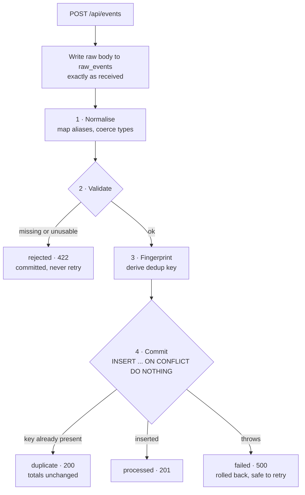

# Ingest Console

A fault-tolerant ingestion pipeline for event data arriving from clients that
each send a different shape, with unreliable formatting and retries.

**Live:** [carbon-crunch-assesment.vercel.app](https://carbon-crunch-assesment.vercel.app/) &nbsp;·&nbsp;
**API:** [carboncrunch-assesment.onrender.com/api/health](https://carboncrunch-assesment.onrender.com/api/health)

> The API runs on Render's free plan and sleeps after 15 minutes of inactivity.
> The first request after a sleep takes around 50 seconds to wake it; the
> console shows an "API unreachable" banner until it comes up.

---

## The problem

Three clients send the same logical event three different ways:

```jsonc
// client_A — nested, amount as a string, slashed date
{ "source": "client_A", "payload": { "metric": "value", "amount": "1200", "timestamp": "2024/01/01" } }

// client_B — flat, different field names entirely
{ "client": "client_B", "type": "value", "total": 1200, "date": "01-01-2024" }

// client_C — unix time, thousands separator, an extra field nobody mentioned
{ "src": "client_C", "data": { "kind": "value", "amt": "1,200.00", "ts": 1704067200, "region": "north" } }
```

All three are the same event: **client, metric `value`, amount 1200, 1 January 2024.**
All three must land as one canonical row, be counted exactly once, and stay
counted exactly once when the client retries after a timeout.

On top of that the system has to survive things it cannot control: malformed
bodies, unknown fields appearing without warning, a brand-new client that was
never configured, and a database write that fails halfway through.

---

## Quick start

Two processes. No configuration, no `.env` file — every setting has a working
default.

```bash
# terminal 1 — API on :4000
cd server
npm install
npm start

# terminal 2 — console on :5173
cd client
npm install
npm run dev
```

Open http://localhost:5173. The database file `server/data.sqlite` is created
on first boot with its schema; there is no migration step.

Vite proxies `/api` to `localhost:4000` ([vite.config.js](client/vite.config.js)),
so the browser only ever talks to one origin and there is no CORS negotiation
in development.

### Try the behaviours

The console ships with a preset for each one:

| Do this | Expect |
|---|---|
| Send `client_A`, `client_B`, `client_C` | three `201`s, one row each, all normalised to the same shape |
| Send any preset **twice** | `201` then `200 duplicate` — the total does not move |
| Send the `malformed` preset | `422 rejected`, with every problem listed at once |
| Tick **Simulate database failure**, send | `500 failed`, rolled back, totals unchanged |
| Untick it and send the same body | `201` — the retry succeeds normally |

---

## How it works

Every request walks the same four stages. **Where it stops is the whole
explanation**, which is why the console draws it as a track rather than a
pass/fail badge.



Stages 1–4 and the raw write all happen inside **one SQLite transaction**
([ingest.js](server/src/services/ingest.js)). `better-sqlite3` commits when the
function returns and rolls back if it throws, so there is no intermediate
state: either the raw record and the canonical event are both durable, or
neither exists.

### Status codes carry meaning

They are written for a retrying client, not just for humans:

| Code | Status | What the client should do |
|---|---|---|
| `201` | `processed` | Nothing. Stored and counted. |
| `200` | `duplicate` | **Stop retrying.** We already had it; nothing was double counted. |
| `422` | `rejected` | **Stop retrying.** The body is malformed; a retry can never succeed. |
| `500` | `failed` | **Retry.** Nothing was written, and the fingerprint will catch it if it had been. |

---

## Design decisions

### Normalisation is forgiving; validation is strict

These are deliberately two separate modules.
[normalize.js](server/src/core/normalize.js) tries hard to find and convert a
value and records `null` when it cannot. It never throws and never rejects.
[validate.js](server/src/core/validate.js) then decides whether a `null` is
acceptable.

Keeping them apart means the rules can be loosened or tightened without
touching the parsing, and normalisation stays a pure function — raw object in,
canonical object out, no database, no HTTP. That makes it trivially testable
and reusable for replaying stored raw events through updated rules later.

Validation's rule of thumb: **reject anything that would corrupt an aggregate,
accept anything that is merely unusual.** A missing amount is fatal, because
`SUM()` over a null is meaningless. An unknown extra field is not, because it
affects nothing downstream.

All problems come back at once. A client fixing one field at a time and
discovering a new error on each retry is a miserable integration.

### Client-specific knowledge lives in exactly one file

[mappings.js](server/src/core/mappings.js) holds every alias and every
per-client override. Adding a client is a data change in that file, not a code
change in the ingestion path. Nothing else in the codebase knows that
`client_B` exists.

Because there is a default alias list underneath the overrides, **a brand-new
client that nobody configured still works** as long as its field names are
recognisable.

### Deduplication hashes the normalised values, not the raw body

[fingerprint.js](server/src/core/fingerprint.js) builds the key **after**
normalisation, so a client that sends `"1200"` on the first attempt and `1200`
on the retry produces one identical key. Hashing the raw bytes would let
formatting drift defeat deduplication entirely.

Two paths, in priority order:

1. The client sent an idempotency key (`event_id`, `idempotency_key`, `uuid`, …).
   Trust it, scoped to that client so two clients cannot collide.
2. No id — the normal case here. Derive the key from the content:
   `client_id + metric + amount + timestamp`, with the amount fixed to six
   decimal places so `1200` and `1200.0` hash identically.

**The trade-off, stated openly:** two genuinely distinct events with the same
client, metric, amount and timestamp collapse into one. Given no unique id,
unreliable timestamps and retries after partial failure, under-counting in that
rare case is better than double-counting on every retry. Double counting
corrupts aggregates silently; a dropped duplicate is visible in the audit log
as `status = 'duplicate'`.

### The UNIQUE constraint is the guarantee, not the application code

The insert is `INSERT ... ON CONFLICT (fingerprint) DO NOTHING`.

There is deliberately **no** "SELECT to check, then INSERT". Those are two
statements, and two concurrent retries can both pass the SELECT before either
INSERT lands — so both write and the total doubles. The database enforces the
constraint atomically and has no such gap. The application code just reports
what the database decided.

### Totals are computed on read, never incremented

[aggregate.js](server/src/services/aggregate.js) recalculates from the `events`
table on every request. Nothing maintains a running counter.

A stored counter could drift out of sync with the events table after any
partial failure, and there would be no way to tell that it had. A derived total
cannot drift — it is recalculated from the same rows that define the truth.
Combined with deduplication, that is what makes the API consistent despite
retries and failures.

The cost is that every query scans matching rows. That is the right trade at
this size and the first thing to change at scale.

### Nothing is thrown away

Every request is written to `raw_events` **exactly as sent**, whatever the
outcome, and `raw_json` is never mutated. If a normalisation rule turns out to
be wrong, the original is still there to replay.

This is also what makes rejections explainable: the console can show the exact
body alongside the reason it was refused.

### Unknown fields are recorded, not ignored and not fatal

A client adding `"region": "north"` without warning must not break ingestion.
Extras are excluded from the canonical row but their names are recorded, so the
team can notice a client is sending something new. Silently ignoring hides
drift; failing loudly breaks ingestion. Recording is the middle path.

---

## API

Base URL: `http://localhost:4000` locally, or the Render URL when deployed.

### `POST /api/events`

Accepts any JSON object. Returns the pipeline outcome and the canonical form.

Add `?simulate_failure=true` to throw mid-transaction, after the write is
staged but before commit — the exact window a real database failure would open.

```bash
curl -X POST http://localhost:4000/api/events \
  -H "Content-Type: application/json" \
  -d '{"source":"client_A","payload":{"metric":"value","amount":"1200","timestamp":"2024/01/01"}}'
```

```jsonc
{
  "status": "processed",
  "raw_event_id": 1,
  "fingerprint": "9f2c…",
  "event": { "id": 1, "client_id": "client_A", "metric": "value", "amount": 1200,
             "timestamp": "2024-01-01T00:00:00.000Z" },
  "canonical": { … },
  "unmapped": []
}
```

### `GET /api/events`

Canonical, successfully processed events.

| Param | Notes |
|---|---|
| `client_id`, `metric` | exact match |
| `from`, `to` | ISO 8601, inclusive |
| `limit` | default 100, capped at 500 |

### `GET /api/raw-events`

The audit trail, including rejections and failures, with the original body.

| Param | Notes |
|---|---|
| `status` | `processed` · `duplicate` · `rejected` · `failed` |
| `limit` | default 100, capped at 500 |

### `GET /api/aggregates`

| Param | Notes |
|---|---|
| `client_id`, `metric` | exact match |
| `from`, `to` | ISO 8601, inclusive |
| `group_by` | `client_id` (default) · `metric` · `none` |

Returns overall totals, the requested grouping, and global ingestion counters.

```bash
curl "http://localhost:4000/api/aggregates?group_by=metric&from=2024-01-01T00:00:00Z"
```

### `GET /api/health`

`{"ok":true}`. Deliberately free of database work, so a slow query never reads
as a dead service.

---

## Field mapping

Tried in order, at the top level and inside any nested container
(`payload`, `data`, `body`, `attributes`, `event`). First match wins.

| Canonical | Accepted names |
|---|---|
| `client_id` | `client_id`, `clientId`, `source`, `client`, `src`, `sender`, `origin` |
| `metric` | `metric`, `type`, `kind`, `name`, `metric_name`, `event_type` |
| `amount` | `amount`, `total`, `amt`, `value`, `qty`, `quantity`, `sum` |
| `timestamp` | `timestamp`, `time`, `date`, `ts`, `occurred_at`, `created_at`, `event_time` |

Per-client overrides sit in front of these. `client_B` uses `value` as its
metric *name* and `total` for the number, so without an override the generic
`amount` list would wrongly grab `value`.

### Coercion

`client_id` is resolved **first**, because it selects the alias set for
everything else.

| Input | Becomes |
|---|---|
| `"1200"`, `"1,200.00"`, `"₹1200"` | `1200` |
| `true` | `null` — rejected explicitly, since `Number(true)` is `1` and would turn a flag into an amount |
| `1704067200`, `"1704067200"` | `2024-01-01T00:00:00.000Z` (seconds or milliseconds) |
| `"2024/01/01"`, `"2024-01-01"` | midnight **UTC**, so the same input never lands on different days on different machines |
| `"31-02-2024"` | `null` — rollover into March is caught |

Timestamps outside 2000-01-01 → one year ahead are rejected. A date far outside
a plausible window usually means the source format was misread, and accepting
it would poison time filters.

---

## Data model

Two tables ([db.js](server/src/db.js)). WAL mode is on, so the aggregation API
can read while ingestion holds a write transaction.

**`raw_events`** — every request, byte for byte, never mutated.

| Column | |
|---|---|
| `raw_json` | the original body |
| `status` | `processed` · `duplicate` · `rejected` · `failed` |
| `reason` | why, when it is not `processed` |

**`events`** — the canonical form. Only well-formed events reach it, so every
aggregation query can trust these columns without defensive checks.

| Column | |
|---|---|
| `fingerprint` | `UNIQUE` — this constraint is what prevents double counting |
| `raw_event_id` | back-reference to the original request |
| `client_id`, `metric`, `amount` | canonical values |
| `timestamp` | ISO 8601 UTC, always — so lexicographic comparison is chronological comparison |

---

## The console

React + Vite, no UI framework. It exists to make the pipeline's behaviour
visible rather than to look like a product:

- **Pipeline trace** — the four stages, with the stopping point coloured by
  outcome. The stopping point *is* the explanation.
- **Aggregates** — filterable, grouped by client or metric, drawn as bars
  because relative size is the question being asked.
- **Status strip** — global ingestion counters. They come from `raw_events` and
  ignore the aggregate filters, which is why they sit apart from them.
- **Records** — canonical rows and the raw audit log side by side, so a
  rejection can always be traced back to the bytes that caused it.

Colour is reserved almost entirely for the four outcomes, so any hue on screen
carries meaning. Dark mode follows the system unless overridden.

---

## Deployment

| | |
|---|---|
| **API** | Render, from [render.yaml](render.yaml). Free plan, `rootDir: server`, health check on `/api/health`, Node pinned to 22 so `better-sqlite3` resolves a prebuilt binary instead of compiling. |
| **Console** | Vercel. Root directory `client`, framework auto-detected as Vite. |

The console reaches the API through one environment variable set on **Vercel**,
not in any file:

```
VITE_API_URL = https://carboncrunch-assesment.onrender.com
```

Origin only — no trailing slash, no `/api`; [api.js](client/src/api.js) appends
the prefix so the variable cannot be got wrong by including or omitting it.
Unset, it falls back to `/api` and the Vite dev proxy, so local development is
unaffected.

Vite inlines `VITE_*` variables **at build time**, so adding or changing this
requires a redeploy to take effect.

---

## Known limitations

**Ambiguous dates are guessed.** `01-02-2024` could be 1 February or 2 January.
`DD-MM-YYYY` is assumed, which is the common convention outside the US. This is
a guess, and a wrong guess silently shifts an event to the wrong day. The right
fix is a per-client `date_format` in [mappings.js](server/src/core/mappings.js);
the simpler default was chosen for now and is flagged rather than hidden.

**SQLite on the free plan is not durable.** Render's free filesystem is
ephemeral, so the database is wiped on every deploy and every wake from idle.
Fine for a demo; the disk block in [render.yaml](render.yaml) is ready to
uncomment on a paid instance. Note that SQLite assumes a single writer, so it
only works while exactly one instance runs.

**Aggregates scan on every request.** Correct at this size, and the first thing
to change at scale — a rollup table, or a real analytical store.

**CORS is open.** `cors()` accepts any origin, which is right for a public demo
but would be narrowed to the console's origin in production.

**The failed-attempt audit row is written outside the transaction.** After a
rollback, nothing was written, so the row recording the failure is a separate
insert. It is deliberately not part of the atomic unit — its only job is to make
the failure visible. In a real outage the database would be unreachable and that
insert would fail too, which is why it is wrapped in its own `try/catch` and why
the real answer is to log to stderr and let the client retry.

---

## Layout

```
server/
  src/
    core/          pure logic, no I/O — testable in isolation
      mappings.js    every client-specific alias, and nothing else
      coerce.js      type conversion; returns null instead of throwing
      normalize.js   raw object -> canonical object
      validate.js    canonical object -> list of problems
      fingerprint.js the dedup key
    services/
      ingest.js      the pipeline, in one transaction
      aggregate.js   read-side queries; knows nothing about ingestion
    routes/        thin HTTP layer — read request, call service, map status
    db.js          schema and connection
client/
  src/
    components/    form, pipeline trace, aggregates, records, status strip
    api.js         every backend call
    styles.css     token-driven; light and dark
```
